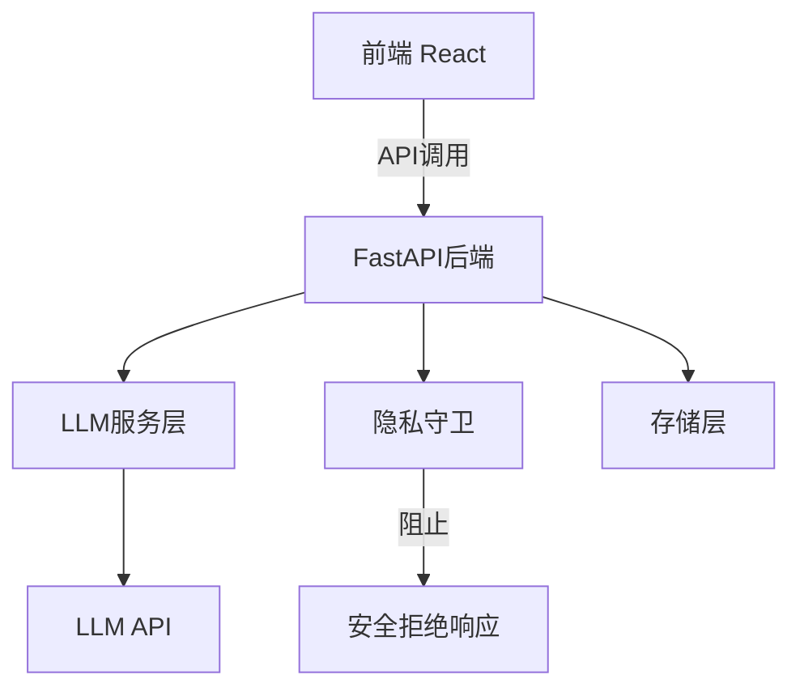

## 产品概述

增强"密码记忆替身"系统，重点实现真实LLM集成和UI完善。

## 核心功能

- 真实LLM集成：替换当前的mock_llm.py，支持通过环境变量配置LLM API（如混元、DeepSeek等）
- 流式响应支持：LLM对话支持streaming响应，提升用户体验
- UI完善：优化前端界面设计、交互体验和视觉效果
- 安全边界保持：确保所有LLM集成仍然通过privacy_guard.py的安全检查

## 技术栈选择

- 后端：Python 3.11+ FastAPI + Pydantic（保持现有栈）
- 前端：React + TypeScript + TailwindCSS（保持现有栈）
- LLM集成：支持OpenAI兼容API（可配置base URL以支持混元、DeepSeek等）
- 依赖添加：openai SDK（可选，也支持直接使用HTTP请求）

## 实现方法

### LLM集成策略

1. 创建`backend/services/llm_service.py`模块
2. 支持环境变量配置：LLM_API_KEY、LLM_BASE_URL、LLM_MODEL
3. 实现streaming和非streaming两种响应模式
4. 保持与现有mock_llm.py相同的接口签名，便于替换

### UI完善策略

1. 优化App.tsx的布局和视觉设计
2. 添加LLM对话的streaming显示支持
3. 改进账号详情展示组件
4. 添加更好的操作反馈和加载状态

## 实现注意事项

- 性能：LLM API调用应设置合理超时和重试机制
- 日志：复用现有日志模式，避免记录敏感信息
- 影响范围控制：保持向后兼容，不破坏现有API接口
- 安全：所有用户输入必须通过privacy_guard.py检查

## 架构设计

### 系统架构图



## 目录结构

```
backend/
  services/
    llm_service.py          [NEW] LLM集成服务模块
    mock_llm.py             [KEEP] 保留作为fallback
frontend/
  src/
    App.tsx                 [MODIFY] UI改进
    api.ts                  [MODIFY] 添加streaming支持
    components/             [NEW] 可复用UI组件
```

## 关键代码结构

```python
# backend/services/llm_service.py 接口定义
async def call_llm(message: str, stream: bool = False) -> dict:
    """调用LLM API，返回统一格式响应"""
    pass
```

## 设计风格

采用现代简约风格，保持专业和可信赖的视觉感受。使用柔和的绿色调作为主色调，传达安全和可靠的感觉。

## 设计内容描述

### 页面规划（最多5个页面）

1. **主工作台页面** - 账号线索列表、操作面板、详情展示
2. **账号编辑页面** - 创建/编辑账号线索表单
3. **LLM对话页面** - 与AI助手对话界面（streaming支持）
4. **安全体检报告页面** - 安全分和风险详情展示
5. **迁移检查报告页面** - 手机号/邮箱迁移影响分析

### 单页面块设计

#### 主工作台页面

1. **顶部导航栏** - 显示系统名称、后端状态指示器、用户操作
2. **左侧导航** - 功能模块导航（账号线索、找回计划、安全体检、迁移检查、OCR导入）
3. **中间内容区** - 账号线索列表（表格视图，支持排序和筛选）
4. **右侧详情面板** - 选中账号的详细信息、操作结果展示
5. **底部操作栏** - 快速操作按钮（刷新数据、导出等）

#### 账号编辑页面

1. **表单头部** - 页面标题、取消/保存按钮
2. **基本信息块** - 平台名称、登录URL、注册方式
3. **登录方式块** - 动态添加的登录方式列表
4. **绑定关系块** - 绑定关系列表（邮箱、手机号、设备、第三方）
5. **恢复路径块** - 恢复路径配置
6. **安全设置块** - MFA状态、认证器位置提示
7. **备注和证据块** - 用户备注、证据来源

### 字体系统

- 字体家族：PingFang SC（正文）, Roboto（代码/技术内容）
- 标题：24px, 600 weight
- 副标题：18px, 500 weight  
- 正文：16px, 400 weight

### 颜色系统

- 主色调：#1d4f3a（深绿）
- 背景色：#f5f4ef（暖白）, #fbfaf6（浅暖白）
- 文本色：#17201b（深灰黑）, #637166（中灰绿）
- 功能色：#2f7d57（成功绿）, #b94a48（危险红）, #b8942f（警告黄）

## Agent Extensions

### Skill

- **systematic-debugging**
- Purpose: 在集成LLM时调试API调用问题
- Expected outcome: 快速定位和修复LLM集成中的问题
- **test-driven-development**
- Purpose: 为LLM服务编写测试先行代码
- Expected outcome: 确保LLM集成质量，所有测试用例通过
- **writing-plans**
- Purpose: 详细规划LLM集成和UI改进的实现步骤
- Expected outcome: 生成清晰可执行的实施计划