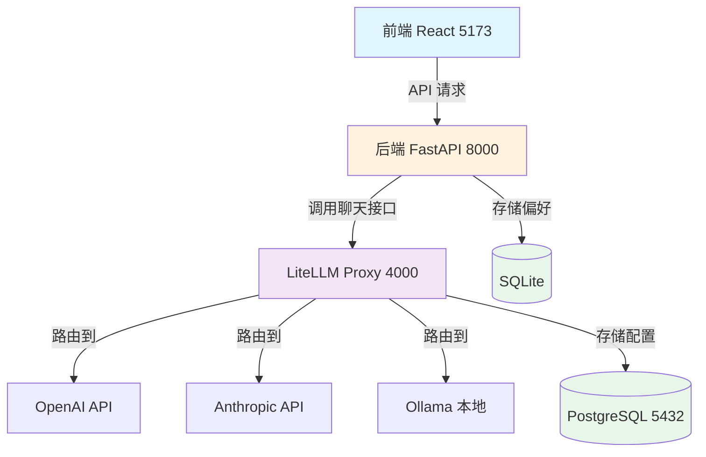

## 用户需求分析

用户需要对现有"密码记忆替身"项目进行真实 LLM 集成测试，核心诉求是：

1. **通用的 LLM 配置页面**：提供一个可视化的配置界面，让用户可以方便地管理 LLM 模型配置
2. **选择 LiteLLM Proxy 方案**：使用 LiteLLM Proxy 作为 LLM 网关，统一管理多个 LLM 提供商
3. **不写死配置在文件中**：配置需要持久化到数据库，而不是硬编码在环境变量或配置文件中

## 产品概述

本项目将为"密码记忆替身"添加一个基于 LiteLLM Proxy 的 LLM 配置管理系统。该系统包含：

- Docker Compose 部署的 LiteLLM Proxy 服务（端口 4000）和 PostgreSQL 数据库（端口 5432）
- 后端 FastAPI 改造，通过 LiteLLM Proxy 统一调用 LLM
- 前端新增"模型配置"页面，支持动态添加/编辑/删除 LLM 模型配置

## 核心功能

1. **LiteLLM Proxy 部署**：通过 Docker Compose 部署 LiteLLM Proxy + PostgreSQL，配置持久化到数据库
2. **后端 LLM 服务改造**：`llm_service.py` 改为调用 LiteLLM Proxy 端点，不再从环境变量读取配置
3. **LLM 配置管理 API**：后端新增 `/llm/models`、`/llm/config` 等端点，用于管理模型配置
4. **前端模型配置页面**：新增"模型配置"导航项，提供可视化界面添加/编辑/测试/删除模型配置
5. **配置持久化**：LiteLLM Proxy 将模型配置存储到 PostgreSQL，后端将默认模型等偏好存储到 SQLite

## 技术栈选型

### 后端

- **FastAPI**（已有）：保持不变
- **httpx**：用于调用 LiteLLM Proxy API
- **SQLite**（Python 内置）：用于存储默认模型等用户偏好设置（轻量级，无需额外依赖）

### 基础设施

- **LiteLLM Proxy**：LLM 网关，统一 OpenAI 兼容接口
- **PostgreSQL 16**：LiteLLM Proxy 配置持久化
- **Docker Compose**：服务编排

### 前端

- **React + TypeScript**（已有）：保持不变
- **Tailwind CSS**（已有）：保持不变
- **lucide-react**（已有）：用于图标

## 实现方案

### 整体架构

LiteLLM Proxy 作为独立服务运行，提供 OpenAI 兼容的 `/v1/chat/completions` 端点。后端 `llm_service.py` 不再直接调用 LLM API，改为调用 LiteLLM Proxy。前端通过后端 API 间接管理 LiteLLM Proxy 的模型配置。

```
前端 (5173) → 后端 FastAPI (8000) → LiteLLM Proxy (4000) → 各 LLM 提供商
```

### LiteLLM Proxy 部署方案

使用 Docker Compose 部署两个服务：

1. **litellm**：LiteLLM Proxy 服务，端口 4000
2. **db**：PostgreSQL 16 数据库，端口 5432

关键配置：

- `STORE_MODEL_IN_DB=True`：模型配置存储到数据库，支持动态更新
- `LITELLM_MASTER_KEY`：管理后台登录密钥
- 数据卷持久化：`litellm-db-data`

### 后端改造方案

#### 1. 新增 `litellm_proxy_client.py`

封装对 LiteLLM Proxy 管理 API 的调用：

- `add_model()`：调用 Proxy 管理 API 添加模型
- `list_models()`：获取已配置的模型列表
- `delete_model()`：删除模型配置
- `chat_completion()`：调用 `/v1/chat/completions` 端点

#### 2. 改造 `llm_service.py`

- 删除 `_llm_config()` 函数（不再从环境变量读取）
- `call_llm()` 改为调用 `litellm_proxy_client.chat_completion()`
- 从 SQLite 读取默认模型配置

#### 3. 新增 LLM 配置管理端点

在 `main.py` 中新增：

- `GET /llm/models`：列出所有可用模型
- `POST /llm/models`：添加新模型配置
- `DELETE /llm/models/{name}`：删除模型配置
- `GET /llm/config`：获取当前生效的配置
- `PUT /llm/config`：更新当前生效的配置

#### 4. 配置持久化

新增 `llm_config_store.py`，使用 SQLite 存储：

- 默认模型名称
- 用户偏好设置

### 前端改造方案

#### 1. 新增 `LLMConfigPage.tsx`

页面布局（从上到下）：

1. **顶部标题区**："LLM 模型配置"
2. **当前配置卡片**：显示当前默认模型、Proxy 连接状态
3. **模型列表区**：卡片式展示已配置的模型
4. **添加模型表单**：模型名称、提供商、API Key、Base URL、模型标识
5. **测试区域**：测试模型调用

#### 2. 更新导航栏

在 `App.tsx` 的 `navItems` 中添加"模型配置"选项。

#### 3. 新增 API 调用函数

在 `api.ts` 中新增：

- `llmModels()`
- `addLLMModel()`
- `deleteLLMModel()`
- `updateLLMConfig()`
- `testLLMModel()`

## 实现注意事项

### 性能考虑

- LiteLLM Proxy 内置请求重试、速率限制，无需在后端重复实现
- 后端调用 Proxy 使用连接池（httpx AsyncClient）
- 前端模型列表使用 React useState，避免频繁请求

### 安全性

- `LITELLM_MASTER_KEY` 存储在后端环境变量，不暴露给前端
- 用户 API Key 通过后端中转，前端不可见
- 生产环境必须为 `LITELLM_MASTER_KEY` 设置强密码

### 向后兼容

- 保留 `mock_llm.py` 作为 fallback
- 如果 LiteLLM Proxy 不可用，回退到 mock 模式

### 爆炸半径控制

- 只修改 `llm_service.py` 和 `main.py`，不影响其他服务
- 新增文件独立，不影响现有功能
- 使用特性开关（`LITELLM_PROXY_URL` 环境变量）控制是否启用 Proxy

## 架构设计

### 系统架构图



### 模块划分

1. **LiteLLM Proxy 模块**（基础设施）：Docker Compose 部署
2. **后端代理客户端模块**：`litellm_proxy_client.py`
3. **后端配置存储模块**：`llm_config_store.py`
4. **后端 API 模块**：`main.py` 新增端点
5. **前端配置页面模块**：`LLMConfigPage.tsx`

## 目录结构

### 概述

本实现为现有项目添加 LiteLLM Proxy 集成和 LLM 配置管理功能。新增 LiteLLM Proxy 部署配置、后端代理客户端、配置存储模块，以及前端模型配置页面。

```
project-root/
├── litellm/                          # [NEW] LiteLLM Proxy 部署配置
│   ├── docker-compose.yml             # LiteLLM Proxy + PostgreSQL 编排
│   ├── config.yaml                   # 初始模型配置（可选）
│   └── .env                         # 环境变量（不提交到 Git）
├── docker-compose.yml                # [MODIFY] 项目根目录，添加 litellm 服务
├── backend/
│   ├── main.py                      # [MODIFY] 新增 /llm/* 端点
│   ├── requirements.txt              # [MODIFY] 确认 httpx 已包含
│   ├── services/
│   │   ├── llm_service.py           # [MODIFY] 改为调用 LiteLLM Proxy
│   │   └── litellm_proxy_client.py  # [NEW] LiteLLM Proxy 客户端封装
│   └── llm_config_store.py          # [NEW] LLM 配置存储（SQLite）
├── frontend/
│   └── src/
│       ├── App.tsx                  # [MODIFY] 添加"模型配置"导航项
│       ├── api.ts                   # [MODIFY] 新增 LLM 配置 API 调用
│       └── pages/
│           └── LLMConfigPage.tsx    # [NEW] 模型配置页面
└── tests/
    └── test_litellm_proxy.py        # [NEW] LiteLLM Proxy 集成测试
```

### 文件详细说明

#### 新增文件

1. **`litellm/docker-compose.yml`**

- 用途：LiteLLM Proxy 和 PostgreSQL 服务编排
- 功能：定义 litellm 服务（端口 4000）和 db 服务（端口 5432），配置健康检查、依赖关系、数据持久化
- 实现要求：使用官方 LiteLLM 镜像，启用 `STORE_MODEL_IN_DB`，配置健康检查

2. **`litellm/.env`**

- 用途：LiteLLM Proxy 环境变量
- 功能：存储 `LITELLM_MASTER_KEY` 等敏感信息
- 实现要求：添加到 `.gitignore`，不提交到 Git

3. **`litellm/config.yaml`**

- 用途：初始模型配置（可选，可通过 UI 动态添加）
- 功能：定义初始模型列表（如 GPT-4o、Llama3）
- 实现要求：API Key 使用环境变量引用（`os.environ/OPENAI_API_KEY`）

4. **`backend/services/litellm_proxy_client.py`**

- 用途：封装对 LiteLLM Proxy 管理 API 的调用
- 功能：提供 `add_model()`、`list_models()`、`delete_model()`、`chat_completion()` 等方法
- 实现要求：使用 httpx AsyncClient，处理错误响应，支持连接池复用

5. **`backend/llm_config_store.py`**

- 用途：存储默认模型等用户偏好设置
- 功能：使用 SQLite 存储键值对配置（如 `default_model`、`default_temperature`）
- 实现要求：使用 Python 内置 sqlite3 模块，无需额外依赖

6. **`frontend/src/pages/LLMConfigPage.tsx`**

- 用途：LLM 模型配置页面
- 功能：展示模型列表、添加/删除模型、设置默认模型、测试模型调用
- 实现要求：使用 Tailwind CSS 样式，遵循现有设计风格（绿色主题 #1d4f3a）

7. **`tests/test_litellm_proxy.py`**

- 用途：LiteLLM Proxy 集成测试
- 功能：测试模型添加、列表获取、聊天调用、模型删除
- 实现要求：使用 pytest，需要 LiteLLM Proxy 运行在测试环境

#### 修改文件

1. **`backend/main.py`**

- 修改内容：新增 `/llm/models`、`/llm/config` 等端点
- 实现要求：调用 `litellm_proxy_client.py` 和 `llm_config_store.py`，添加认证（使用 master key）

2. **`backend/services/llm_service.py`**

- 修改内容：删除 `_llm_config()`，改为调用 `litellm_proxy_client.chat_completion()`
- 实现要求：保留 `safety_block` 检查，添加 fallback 到 mock_llm

3. **`backend/schemas.py`**

- 修改内容：新增 LLM 配置相关 schema（`LLMModelAddRequest`、`LLMConfigUpdateRequest`）
- 实现要求：使用 Pydantic BaseModel，添加类型注解

4. **`frontend/src/App.tsx`**

- 修改内容：在 `navItems` 数组中添加"模型配置"选项
- 实现要求：使用 `Settings` 图标（需要从 lucide-react 导入）

5. **`frontend/src/api.ts`**

- 修改内容：新增 `llmModels()`、`addLLMModel()` 等 API 调用函数
- 实现要求：遵循现有 `createApiClient` 模式，添加类型定义

6. **`docker-compose.yml`（项目根目录）**

- 修改内容：添加 litellm 和 db 服务定义
- 实现要求：配置服务依赖、网络、数据卷

## 关键代码结构

### 后端：LiteLLM Proxy 客户端接口

```python
# backend/services/litellm_proxy_client.py

import httpx
from typing import Any

class LiteLLMProxyClient:
    """LiteLLM Proxy 管理 API 客户端"""
    
    def __init__(self, base_url: str, master_key: str):
        self.base_url = base_url.rstrip("/")
        self.master_key = master_key
        self._client = httpx.AsyncClient(
            headers={"Authorization": f"Bearer {master_key}"},
            timeout=30.0,
        )
    
    async def add_model(self, model_name: str, litellm_params: dict[str, Any]) -> dict[str, Any]:
        """添加模型配置"""
        ...
    
    async def list_models(self) -> list[dict[str, Any]]:
        """列出所有模型"""
        ...
    
    async def delete_model(self, model_name: str) -> dict[str, Any]:
        """删除模型配置"""
        ...
    
    async def chat_completion(self, model: str, messages: list[dict], api_key: str | None = None) -> dict[str, Any]:
        """调用聊天补全接口"""
        ...
```

### 前端：LLM 配置页面组件结构

```typescript
// frontend/src/pages/LLMConfigPage.tsx

type LLMModel = {
  model_name: string;
  litellm_params: Record<string, unknown>;
  created_at?: string;
};

type LLMConfig = {
  default_model?: string;
};

function LLMConfigPage() {
  const [models, setModels] = useState<LLMModel[]>([]);
  const [config, setConfig] = useState<LLMConfig>({});
  const [loading, setLoading] = useState(false);
  
  // 加载模型列表
  const loadModels = async () => { ... };
  
  // 添加模型
  const handleAddModel = async (values: LLMModelAddRequest) => { ... };
  
  // 删除模型
  const handleDeleteModel = async (modelName: string) => { ... };
  
  // 测试模型
  const handleTestModel = async (modelName: string) => { ... };
  
  return (
    <div className="space-y-6">
      {/* 当前配置卡片 */}
      {/* 模型列表 */}
      {/* 添加模型表单 */}
    </div>
  );
}
```

## 实施顺序

1. **部署 LiteLLM Proxy**（Phase 1）：创建 `litellm/` 目录和 Docker Compose 配置，启动服务
2. **改造后端**（Phase 2）：新增 `litellm_proxy_client.py`、`llm_config_store.py`，改造 `llm_service.py` 和 `main.py`
3. **改造前端**（Phase 3）：新增 `LLMConfigPage.tsx`，更新 `App.tsx` 和 `api.ts`
4. **测试验证**（Phase 4）：运行 `tests/test_litellm_proxy.py`，手动测试前端配置页面

## 设计风格

采用与现有项目一致的**自然绿色主题**（#1d4f3a 为主色调），保持整体视觉风格统一。设计遵循以下原则：

1. **一致性**：沿用现有 App.tsx 的配色方案、圆角、阴影、间距
2. **实用性**：配置页面需要清晰展示模型列表、状态、操作按钮
3. **友好性**：表单验证、错误提示、测试反馈需要直观易懂

## 页面规划

### 模型配置页面（LLMConfigPage.tsx）

页面分为以下区块（从上到下）：

#### 1. 页面标题区

- 显示"LLM 模型配置"标题
- 副标题："管理 LLM 模型提供商和 API 配置"
- 右侧显示 Proxy 连接状态（绿色=已连接，红色=未连接）

#### 2. 当前配置卡片

- 显示当前默认模型名称
- 显示 Proxy 地址（如 `http://localhost:4000`）
- "编辑"按钮：打开默认模型选择对话框

#### 3. 模型列表区

- 卡片网格布局（响应式：1列/2列/3列）
- 每个模型卡片包含：
- 模型名称（大号字体）
- 提供商图标（OpenAI、Anthropic、Ollama 等）
- 状态指示器（绿色圆点=可用，红色圆点=不可用）
- 操作按钮组："设为默认"、"测试"、"删除"（删除需确认）

#### 4. 添加模型表单区

- 可折叠/展开的表单卡片
- 表单字段：
- 模型名称（自定义别名，如 `my-gpt4`）
- 提供商（下拉选择：OpenAI、Anthropic、Dashscope、Ollama、Custom）
- API Key（密码输入框，带显示/隐藏切换）
- Base URL（可选，Ollama 等需要）
- 模型标识（如 `gpt-4o`、`claude-3-opus`、`llama3`）
- "添加模型"按钮（绿色主题色）
- "测试连接"按钮（添加前测试 API 可用性）

#### 5. 测试结果显示区

- 成功：绿色提示框，显示"连接成功"和响应时间
- 失败：红色提示框，显示错误信息和建议

## 交互设计

1. **添加模型**：填写表单 → 点击"测试连接" → 测试成功后点击"添加模型" → 卡片动画添加到列表
2. **删除模型**：点击"删除" → 确认对话框 → 卡片动画移除
3. **设为默认**：点击"设为默认" → 当前配置卡片更新
4. **测试模型**：点击"测试" → 显示 loading → 显示成功/失败结果

## 响应式设计

- **桌面端（>1024px）**：3列模型卡片网格，侧边栏导航
- **平板端（768px-1024px）**：2列模型卡片网格
- **移动端（<768px）**：1列模型卡片，导航栏折叠为汉堡菜单

## 视觉细节

- **配色**：沿用现有绿色主题（#1d4f3a 主色、#2f7d57 成功色、#b94a48 错误色）
- **圆角**：大卡片 12px，小卡片/按钮 8px
- **阴影**：卡片阴影 `shadow-sm`，hover 时 `shadow-md`
- **动画**：卡片添加/删除使用 fade + slide 动画，按钮 hover 使用 scale(1.02)
- **字体**：PingFang SC（已有项目使用）

## Agent Extensions

### SubAgent

- **code-explorer**
- 用途：在规划阶段探索代码库，了解现有项目结构、文件组织、代码模式
- 预期结果：获取准确的项目结构信息，确保规划方案与现有代码库一致

### Skill

- **brainstorming**
- 用途：在创建功能前进行需求分析和设计探索
- 预期结果：明确用户意图，生成完整的技术设计方案

- **writing-plans**
- 用途：创建多步骤任务的实施计划
- 预期结果：生成结构化的实施计划，包含详细的步骤和验证方法

- **test-driven-development**
- 用途：在实现功能前先编写测试
- 预期结果：确保代码质量，验证功能正确性

- **systematic-debugging**
- 用途：遇到 bug 或测试失败时进行系统化调试
- 预期结果：快速定位问题根源，避免盲目修复

- **requesting-code-review**
- 用途：完成功能后请求代码审查
- 预期结果：发现潜在问题，提升代码质量

- **verification-before-completion**
- 用途：在声称工作完成前进行验证
- 预期结果：确保功能真正完成，避免虚假声明